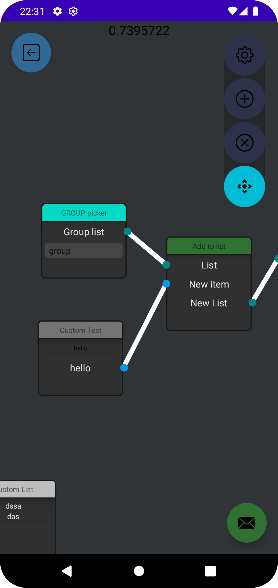

# AndroidNodeSystem - Node system proof of concept

Implementation of a node system simliar to blender shaders one with the ability to send strings between the nodes, snapping, zooming and movement

